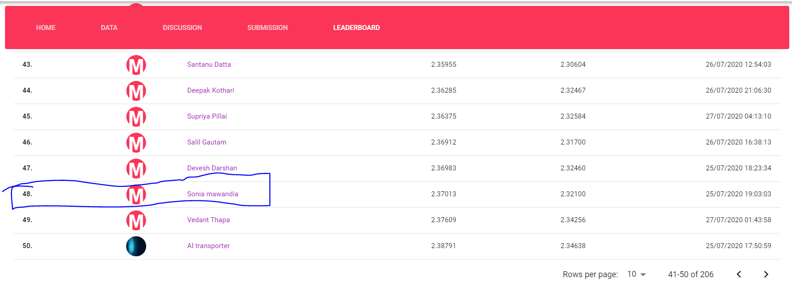

# Power-Plant-Energy-Output-Prediction-Weekend-Hackathon-1
Ref: https://www.machinehack.com/hackathons/power_plant_energy_output_prediction_weekend_hackathon_13

## Overview
The dataset was collected from a Combined Cycle Power Plant over 6 years (2006-2011) when the power plant was set to work with a full load. Features consist of hourly average ambient variables Temperature (T), Ambient Pressure (AP), Relative Humidity (RH), and Exhaust Vacuum (V) to predict the net hourly electrical energy output (PE) of the plant.
A combined-cycle power plant (CCPP) is composed of gas turbines (GT), steam turbines (ST), and heat recovery steam generators.

In a CCPP, the electricity is generated by gas and steam turbines, which are combined in one cycle, and is transferred from one turbine to another. While the Vacuum is collected from and has an effect on the Steam Turbine, the other three of the ambient variables affect the GT performance.

##### This Jupyter notebook was a simple but a very effective solution in getting a private leaderboard rank at 48

